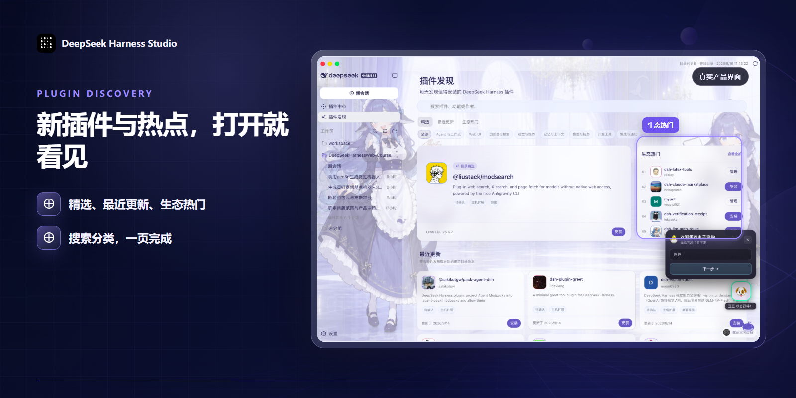
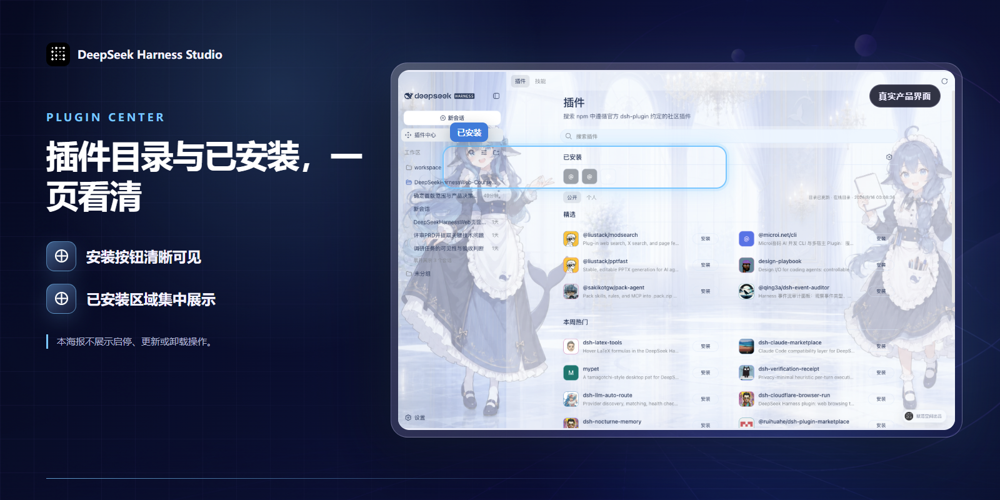
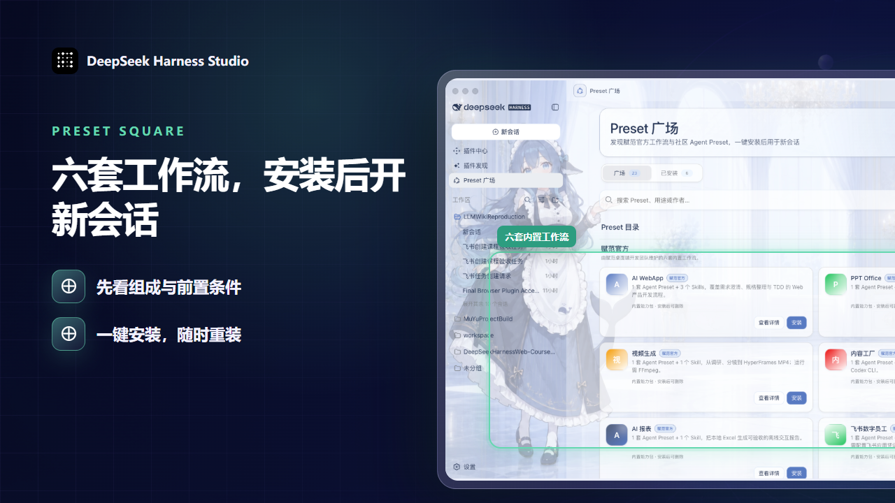
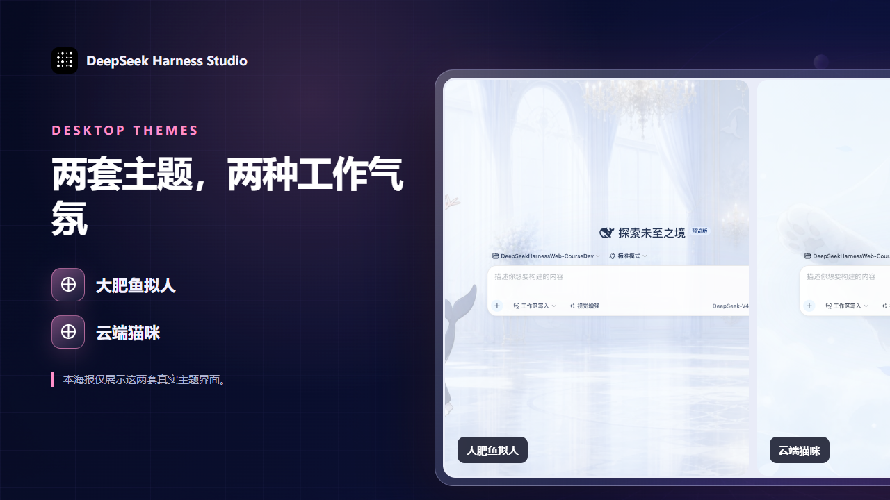

<p align="center">
  
</p>

<h1 align="center">DeepSeek Harness，一键启动的桌面增强工作台</h1>

<p align="center"><strong>一键启动，支持 Windows 与 macOS；内置插件发现、热点插件推送、一键安装与管理、AI 智能推荐和视觉增强。</strong></p>

<p align="center">把原本分散在命令行、插件目录和多个页面里的动作，接进同一套桌面工作流。</p>

<p align="center">
  <a href="https://github.com/fufankeji/deepseek-harness-studio/stargazers"></a>
  
  
  
  <a href="LICENSE"></a>
</p>

<p align="center">
  <a href="https://github.com/fufankeji/deepseek-harness-studio/releases"><strong>下载 macOS arm64 开发预览</strong></a>
  ·
  <a href="https://github.com/fufankeji/deepseek-harness-studio/releases/download/desktop-preview-v0.1.0-rc.7/DeepSeek-Harness-Desktop-Windows-x64-0.1.0-rc.7-Setup.exe"><strong>下载 Windows x64 开发预览</strong></a>
</p>

<p align="center"><a href="https://www.beyondata.com/">官方网站</a> · <strong>中文</strong> · <a href="README.en.md">English</a></p>

> **当前状态：** Windows x64 与 macOS arm64 均为开发预览，不代表正式稳定版本。桌面安装包只通过本仓库的 GitHub Releases 发布。

## 先看真实界面，再决定要不要下载

下面是当前桌面端的真实功能演示。先看工作区、插件入口和实际交互，再继续了解每项能力。

<p align="center">
  
</p>

[查看功能演示视频](https://github.com/user-attachments/assets/0717f7c7-a872-4d2b-acc2-3a1c4874c732)

## 找插件、看理由、装上、管理，一条链路走完

插件真正费时间的，往往不是点击安装，而是先去哪里找、该选哪个、装前要核对什么、装完又在哪里管理。DeepSeek Harness Studio 把这些动作接进桌面端，同时保留安装与高权限操作所需的用户确认。

<p align="center">
  
</p>

插件发现页集中呈现精选、最近更新和生态热门，也支持按名称、功能或作者搜索，并通过分类快速筛选。

<p align="center">
  
</p>

直接描述目标，Agent 会只读查询公开 `dsh-plugin` 目录，返回相关候选和匹配理由。推荐结果不等于兼容确认，安装仍由插件中心完成。

<p align="center">
  
</p>

插件中心覆盖热门发现、确认安装与已安装管理；可启用、停用、更新或卸载。卸载默认保留配置和数据，需要清理时再单独确认。

## 一个 Preset，装下整套工作方式

<p align="center">
  
</p>

Preset 把角色、工作规则、Skills 与工具组合成一套可复用的工作方式。当前内置 AI WebApp、PPT Office、视频生成、内容工厂、AI 报表和飞书数字员工六套工作流。

> **使用路径：** 发现 Preset → 查看组成与前置条件 → 安装 → 用于新会话。

当前内置六套赋范官方工作流：

| Preset | 可以交付什么 | 前提与边界 |
| --- | --- | --- |
| **AI WebApp** | 从需求澄清、规格整理到 TDD 验收的可运行 Web 产品 | 包含 1 个 Preset 与 3 个 Skills |
| **PPT Office** | 8 页、四主题、可离线播放的单文件 HTML 演示文稿 | 当前不生成 `.pptx` |
| **视频生成** | 从事实调研、分镜和视频源码到 16:9 MP4 | 运行环境需要 FFmpeg 与 ffprobe |
| **内容工厂** | 把长文拆成 1–10 张风格一致的系列图文卡片 | 真实生图前需要本机 Codex CLI 已登录并具备 ImageGen 能力 |
| **AI 报表** | 从本地 Excel 生成可核验的离线交互报告 | 原始 Excel 保持只读，报告只嵌入聚合数据 |
| **飞书数字员工** | 把自然语言指令转成真实飞书任务并返回双端回执 | 首次使用需要配置飞书应用凭据与默认负责人 |

> “赋范官方”表示由赋范桌面端开发团队内置和维护，不代表 DeepSeek Harness 官方。用户 Preset 可以删除并重新安装。

<details>
<summary><strong>查看六套工作流的真实案例图</strong></summary>

<br>

<table>
  <tr>
    <td width="50%" align="center"></td>
    <td width="50%" align="center"></td>
  </tr>
  <tr>
    <td align="center"><strong>AI WebApp</strong></td>
    <td align="center"><strong>PPT Office</strong></td>
  </tr>
</table>

<table>
  <tr>
    <td width="50%" align="center"></td>
    <td width="50%" align="center"></td>
  </tr>
  <tr>
    <td align="center"><strong>视频生成</strong></td>
    <td align="center"><strong>内容工厂</strong></td>
  </tr>
</table>

<table>
  <tr>
    <td width="50%" align="center"></td>
    <td width="50%" align="center"></td>
  </tr>
  <tr>
    <td align="center"><strong>AI 报表</strong></td>
    <td align="center"><strong>飞书数字员工</strong></td>
  </tr>
</table>

这些图片来自六套工作流的真实案例成果。Desktop 安装包只交付运行所需的精简 Preset、Skills 与工具适配，不会把案例源码、输入数据、截图或生成成品写入用户环境。

</details>

<details>
<summary><strong>查看 Preset 安装与运行边界</strong></summary>

- 打开详情可以查看角色、Skill、工具、外部依赖和来源说明。
- 安装时，Desktop 会校验来源、大小、摘要和归档路径，再写入本地用户 Preset 目录。
- 安装完成后无需重启 Host，可从“已安装”直接用于新会话。
- 安装、删除和用于新会话涉及本机文件与 Host，只在 Desktop 中执行；浏览器开发模式不会修改本机 Preset。

</details>

## 桌面端不只管理插件

<p align="center">
  
</p>

百炼 `qwen3.8-max` 先读取对话附件或工作区图片，再把可追溯的视觉观察交给当前 Agent。支持截图、照片、图表和 OCR，不替换 DeepSeek 主模型，也不改变原有权限与会话流程。

### 权限和思考模式，直接在中文输入区里选

当前会话可以选择三档中文权限：

- `只读`：查看信息，不写入工作区。
- `工作区写入`：允许 Agent 修改当前工作区。
- `完全访问`：开放更高权限，启用前需要再次确认风险。

模型与 API Key 仍在设置页统一管理。输入区会显示当前 DeepSeek 模型，并提供 `关闭思考`、`深度思考` 和 `最大思考` 三种模式，不显示 DeepSeek 不支持的速度档位。

通用设置只决定新会话的默认权限；当前会话仍以输入区选择为准。

### 工作台不必只剩一种灰

<p align="center">
  
</p>

内置“官方原版”“大肥鱼拟人”和“云端猫咪”三套外观，也支持选择本地图片。自定义图片在本机完成裁切和界面配色适配，不上传原图。

<p align="center">
  
</p>

<p align="center"><strong>扫码获取完整、详细的 DSH 教程及更多大模型开发免费实战项目跟练。</strong></p>

<p align="center">手机扫码，进入学习入口</p>

## 下载桌面端

GitHub Releases 已提供经过真实 Electron 验收的 macOS Apple Silicon 预览 ZIP 和 Windows x64 预览安装程序。运行桌面端不需要另行安装 Node.js 或 pnpm。

<p align="center">
  <a href="https://github.com/fufankeji/deepseek-harness-studio/releases"><strong>下载 macOS arm64 开发预览</strong></a>
  ·
  <a href="https://github.com/fufankeji/deepseek-harness-studio/releases/download/desktop-preview-v0.1.0-rc.7/DeepSeek-Harness-Desktop-Windows-x64-0.1.0-rc.7-Setup.exe"><strong>下载 Windows x64 开发预览</strong></a>
</p>

> macOS arm64 与 Windows x64 当前均为开发预览资产。开发预览使用独立 Pre-release 标签，不触发正式安装器发布。

<details>
<summary><strong>macOS arm64 首次打开</strong></summary>

下载并解压预览 ZIP 后，建议先把 `DeepSeek Harness.app` 拖入“应用程序”目录。由于当前预览包尚未经过 Apple 公证，首次打开前需要在终端执行：

```sh
xattr -dr com.apple.quarantine "/Applications/DeepSeek Harness.app"
open "/Applications/DeepSeek Harness.app"
```

如果应用不在“应用程序”目录，请把命令中的路径替换为实际路径。该命令只应用于从本仓库 GitHub Releases 下载并核验过 SHA-256 的预览包，不要用于来源不明的应用。

</details>

<details>
<summary><strong>Windows x64 安装说明</strong></summary>

下载 `DeepSeek-Harness-Desktop-Windows-x64-0.1.0-rc.7-Setup.exe` 后直接运行安装程序。

Release 的公开下载区只保留 macOS ZIP 和 Windows 安装程序；校验文件、blockmap 与平台验收记录保留在对应 GitHub Actions 构建中，避免普通用户误下载开发文件。

</details>

## 如果你要继续开发，完整源码也在这里

DeepSeek Harness Studio 使用 Electron 承载 DeepSeek Harness 的 Web 工作区。桌面主进程负责启动本地 `dsh web`、等待 Host 就绪，并在应用退出时关闭对应进程。

仓库同时包含桌面应用、Web 界面、CLI、功能包、原生辅助模块、Python SDK、示例和构建脚本。

### 从源码启动

环境要求：

- Node.js `^22.19.0 || >=24.0.0`
- pnpm `11.7.0`

```sh
git clone https://github.com/fufankeji/deepseek-harness-studio.git
cd deepseek-harness-studio
pnpm install
pnpm run dev:desktop
```

下载源码、安装依赖和启动桌面开发环境不需要预先填写 API Key。实际调用模型时，再在设置中配置所选模型服务与凭证；凭证不要提交到 Git。

<details>
<summary><strong>目录结构</strong></summary>

```text
deepseek-harness-studio/
├── apps/
│   ├── desktop/       # Electron 主进程、preload、Host 生命周期与桌面构建脚本
│   ├── web/           # DeepSeek Harness Web 界面入口与桌面端组合
│   └── cli/           # dsh CLI、运行配置与 Agent Preset
├── packages/          # Agent、模型、工具、会话、插件和客户端能力包
├── native/            # 原生沙箱辅助模块
├── python/            # Python SDK 与相关运行时
├── examples/          # 可运行示例与配置
├── scripts/           # 构建、检查、生成和发布脚本
├── website/           # 项目文档站源码
├── vendor/            # 固定版本的 Cordis 基础源码
└── assets/            # README 使用的项目图片
```

</details>

<details>
<summary><strong>常用开发命令</strong></summary>

| 命令 | 用途 |
| --- | --- |
| `pnpm run dev:desktop` | 构建必要模块并启动 Electron 桌面应用 |
| `pnpm run dev:desktop:rebuild` | 强制完整重建后启动桌面应用 |
| `pnpm run build` | 构建 Host、客户端、Web 与桌面端 |
| `pnpm run package:desktop` | 为当前平台生成未封装桌面应用 |
| `pnpm run typecheck` | 运行 TypeScript 类型检查 |
| `pnpm run test` | 运行 Vitest 单元测试 |

</details>

<details>
<summary><strong>建议阅读顺序</strong></summary>

1. `apps/desktop/src/main.ts`：桌面入口、窗口、托盘与本地 Host 组合。
2. `apps/desktop/src/host-supervisor.ts`：`dsh web` 的启动、就绪检测与退出管理。
3. `apps/desktop/src/preload.ts`：Renderer 可以访问的固定桌面接口。
4. `apps/web/`：桌面窗口加载的 Web 工作区。
5. `apps/cli/` 与 `packages/`：CLI 组合及 Harness 能力实现。

</details>

## 当前已交付

以下能力已经在当前源码或桌面开发预览中提供：

- Electron 桌面端、本地 Harness Host 与 Web 工作区
- 插件发现、最近更新、生态热门、场景分类与搜索
- Agent 自然语言找插件及推荐理由
- 公开插件中心的一键安装、启用、停用、更新与卸载
- Preset 广场、六套内置工作流及用于新会话
- 视觉增强、中文权限和 DeepSeek 思考模式
- 三套内置外观与本地图片自定义主题

## 路线图：以下仍是规划

下列能力尚未作为当前已交付功能：

- 独立的 MCP、Skills 与工具发现和连接管理
- 自定义 Agent 与多 Agent 协作
- 任务规划、后台运行与会话恢复
- 项目规则、Hooks 与长期记忆
- Git、Worktree 与代码审查
- 浏览器与桌面自动化
- 手机远程与消息通道

规划能力只会在真实功能可以运行并完成验收后更新状态。

## 与 DeepSeek Harness 的关系

本项目基于 [deepseek-ai/deepseek-harness](https://github.com/deepseek-ai/deepseek-harness) 的 Harness 核心、Cordis 插件体系和 Web 界面继续开发。本仓库维护 Electron 桌面入口、本地 Host 管理、桌面交互与配套开发脚本。

## 许可证

本项目使用 [MIT License](LICENSE)。第三方组件的许可证信息见 [THIRD_PARTY_NOTICES.md](THIRD_PARTY_NOTICES.md)。
